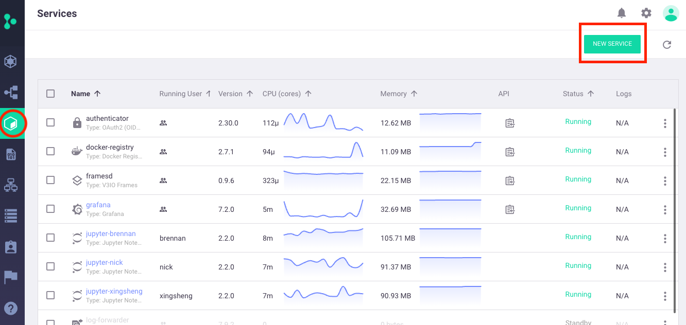
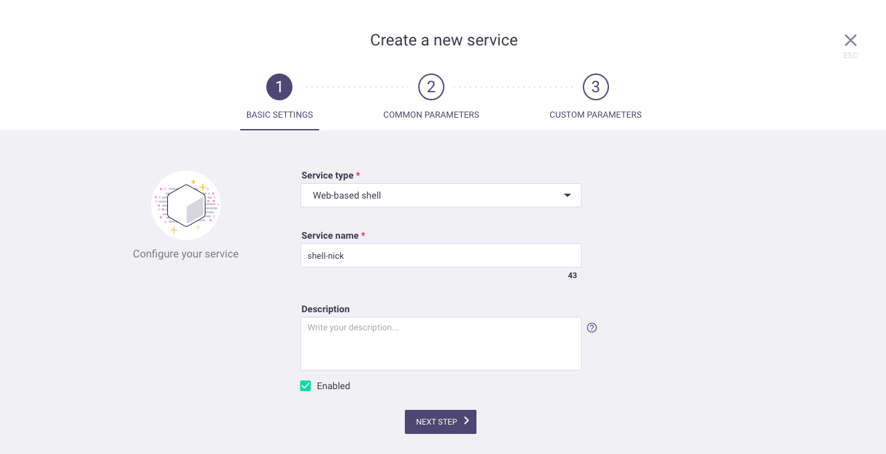
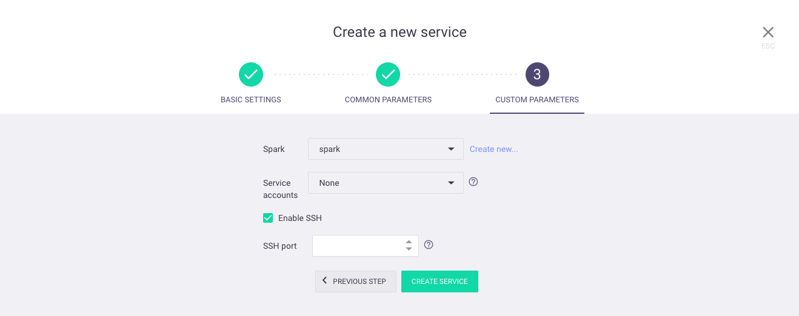
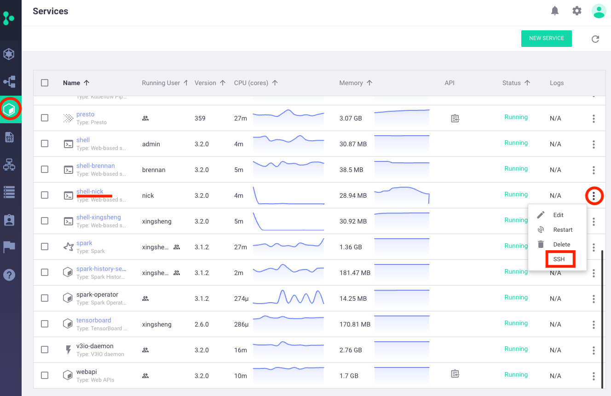
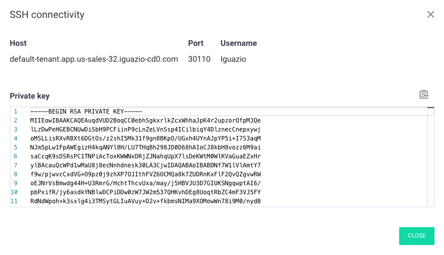

# Iguazio + Rsync

In this guide, we will sync a local directory to the Iguazio cluster using the `rsync` command line tool. We do this using the Iguazio web-shell and SSH connectivity.
1. [Create Iguazio Web Shell](#1-create-iguazio-web-shell)
2. [Download SSH Key to Local Machine](#2-download-ssh-key-to-local-machine)
3. [Ensure SSH Port is Open (optional)](#3-ensure-ssh-port-is-open-optional)
4. [Test SSH Connection and Download Rsync](#4-test-ssh-connection-and-download-rsync)
5. [Create Directories to Sync](#5-create-directories-to-sync)
6. [Sync Local Files to Remote Directory](#6-sync-local-files-to-remote-directory)
7. [Daily Usage](#7-daily-usage)

## 1. Create Iguazio Web Shell

First step is to create the Iguazio web shell. Select `New Service` under the `Services` tab:



One of the options should be web shell. Name it as you see fit:



In the `Custom Parameters` step, there is a field for `Enable SSH`. Click this box. You can manually specify an SSH port in the range of `30000–32767` or leave it blank to select one randomly:



Select `Create Service` and `Apply Changes` to spin up the web shell.

## 2. Download SSH Key to Local Machine

Once the web shell is created, we need to download the SSH private key to our local machine. Under the `Services` tab, navigate to the new web shell service, click the 3 dots on the far right hand side, and select `SSH`:



This will bring up a dialog that displays the host, username, SSH port, and SSH private key:



Copy the private key and save it to a file on your local machine. Additionally, adjust the permissions so SSH will accept the key.

```bash
# Store key somewhere - this is where I will be storing
cd /Users/nick/Downloads

# Add private key
vi ssh.key

# Adjust permissions so SSH will accept the key
chmod 600 ssh.key
```

## 3. Ensure SSH Port is Open (optional)

This step can be skipped for on-premise clusters. This step is mainly for cloud managed Kubernetes clusters such as EKS. The procedure is different for each cloud provider, but essentially ensure that the SSH port (`30110` in our case) has incoming traffic enabled.

## 4. Test SSH Connection and Download Rsync

Now that the web shell and SSH keys are in place, we can test the connection. Be sure to substitute the `host` and `port` from above. The username will always be `iguazio`. Run the following from you **local machine**:

```bash
ssh -i /Users/nick/Downloads/ssh.key -p 30110 iguazio@default-tenant.app.us-sales-32.iguazio-cd0.com
```

You should successfully login to the web shell and see the following prompt (with your username):

```bash
[ nick @ iguazio-system 18:11:33 ] User $
```

The last step before we can `rsync` between the machines is to actually download `rsync` into the web shell as it does not come by default. We will be downloading a pre-complied binary from this [GitHub repository](https://github.com/JBBgameich/rsync-static).

In your **Iguazio web shell**, run the following: 

```bash
# Go to home directory
cd

# Fetch rsync binary
wget https://github.com/JBBgameich/rsync-static/releases/download/continuous/rsync-x86

# Rename and adjust permissions
mv rsync-x86 rsync
chmod u+x rsync
```

You should now be able to run `rsync` located in `/igz/rsync`

## 5. Create Directories to Sync

On my **local machine**, I will create a directory and populate with some test files:

```bash
# Create and navigate to directory
mkdir /Users/nick/Downloads/sync
cd /Users/nick/Downloads/sync

# Create test files
touch 1.txt 2.txt 3.txt
```

On the **Iguazio web shell**, I will create a directory but will not populate with any files. Note that `/User` is mounted to your home directory in `Jupyter`:

```bash
# Create directory to sync
mkdir /User/sync
```

## 6. Sync Local Files to Remote Directory

Now we can sync the local directory to the Iguazio cluster. Run the following on your **local machine.** Note the `--rsync-path` flag in the command which points to the `rsync` binary we downloaded. Additionally, note the location of the SSH key (`-i`) and the SSH port (`-p`). These will need to be adjusted.**:**

```bash
rsync -avz -e "ssh -i /Users/nick/Downloads/ssh.key -p 30110" /Users/nick/Downloads/sync/ iguazio@default-tenant.app.us-sales-32.iguazio-cd0.com:/User/sync --rsync-path=/igz/rsync
```

This will output the following which shows that the command works.

```bash
building file list ... done
./
1.txt
2.txt
3.txt

sent 231 bytes  received 92 bytes  215.33 bytes/sec
total size is 0  speedup is 0.00
```

Finally, if we check the synced directory on the **Iguazio web shell**, we should see the following:

```bash
ls /User/sync
```

Which shows us the files we expected!

```bash
1.txt  2.txt  3.txt
```

## 7. Daily Usage

Once the web shell/SSH key/directories are in place, the daily usage is quite simple. Simply run the following sync command whenever there are updates to the local directory:

```bash
rsync -avz -e "ssh -i /Users/nick/Downloads/ssh.key -p 30110" /Users/nick/Downloads/sync/ iguazio@default-tenant.app.us-sales-32.iguazio-cd0.com:/User/sync --rsync-path=/igz/rsync
```